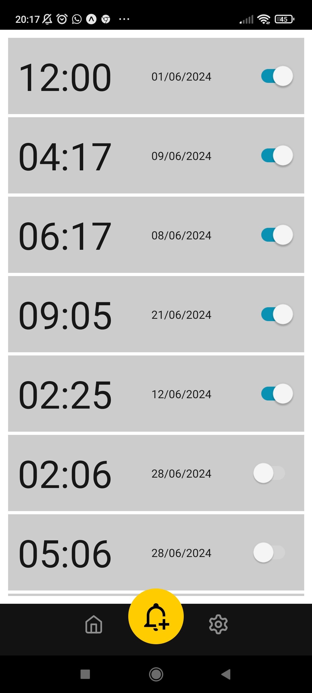
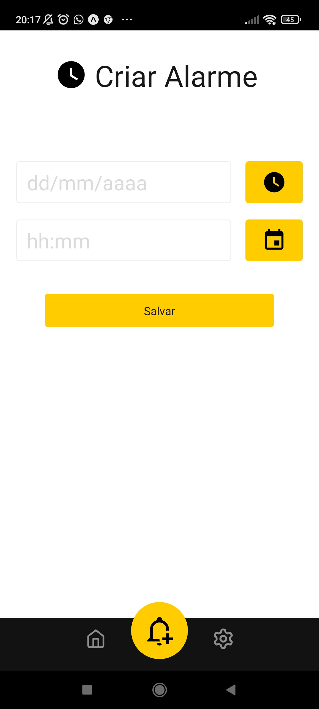

# Appalarme

Defina alarmes que se repetem diariamente, perfeito para quem tem uma rotina regular e não quer configurar o alarme todos os dias.

## Sobre a Appalarme

Um App simples somente para aprimorar o conhecimento.

### `Status`

Em Desenvolvimento

### `O que foi Usado?`

- React Native
- Sqlite
- NativeBase
- Expo
<!--  
- [www.themoviedb.org](www.themoviedb.org)
 
- [www.themoviedb.org](http://warezcdn.com/) -->

### `Galeria de Captura de Telas`

   

     
   

   

     
   
  

 <!--  
  | -->
